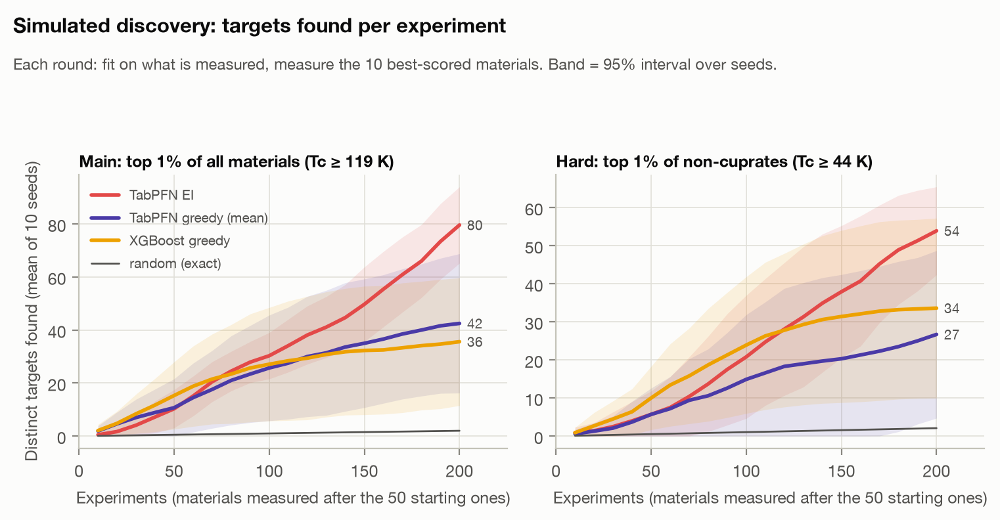
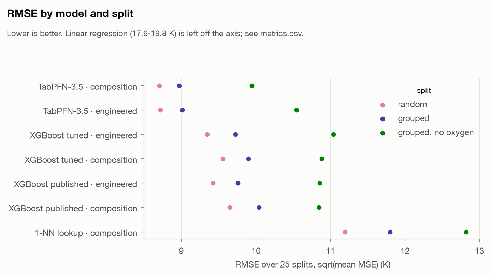
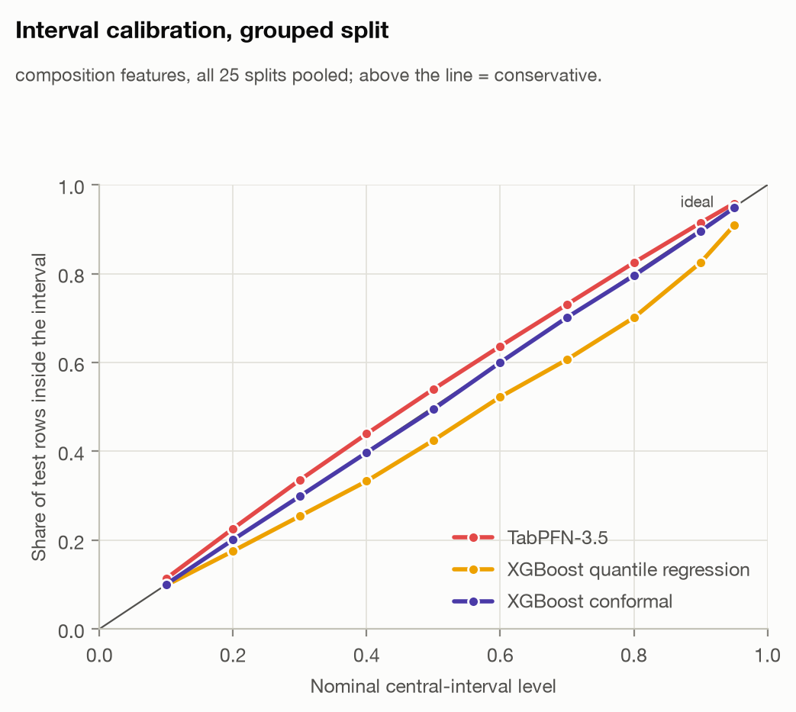
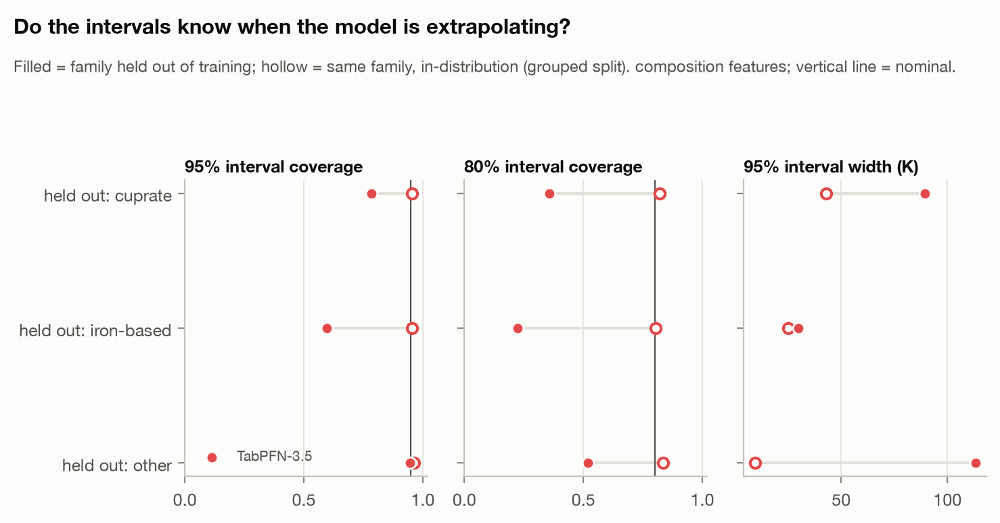
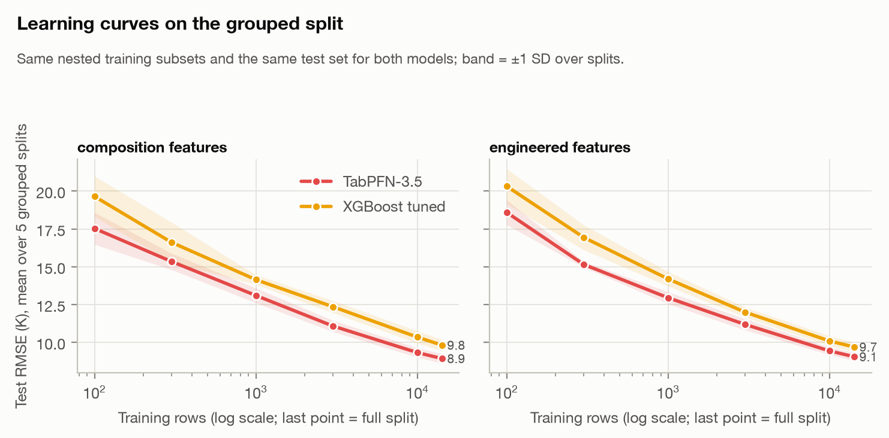
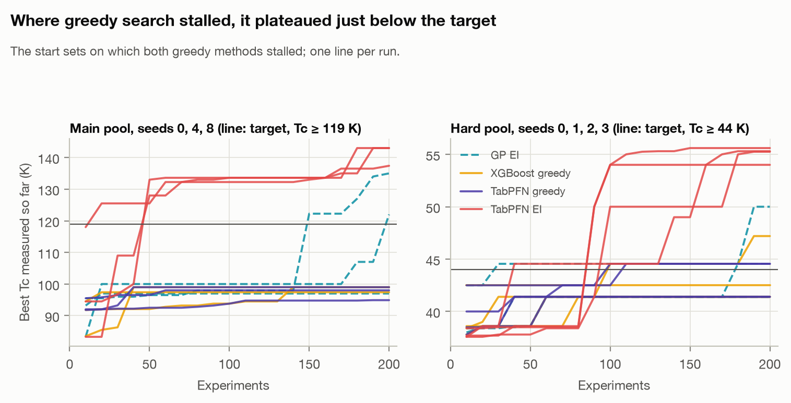
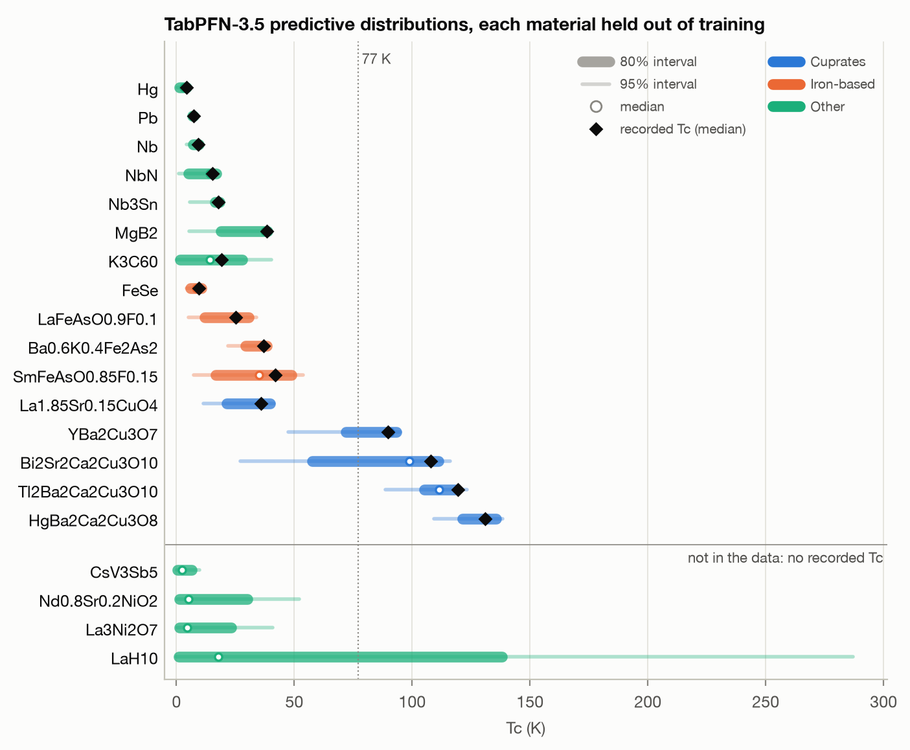

# Hunting superconductors with TabPFN-3.5's predictive distribution

[](https://github.com/qeremeren/Superconductivity-Data-Analysis/actions/workflows/reproduce.yml)

Entry for the Prior Labs TabPFN-3.5 Hackathon. We take the standard superconductor dataset
(21,263 records from NIMS SuperCon, Hamidieh 2018) and ask three questions:

1. **Is TabPFN-3.5 more accurate than XGBoost**, the model of the original paper, once the
   benchmark is protected against duplicate leakage and XGBoost gets a real tuning budget?
2. **Is its uncertainty usable?** The paper gives one global ±9.5 K for every material.
   TabPFN gives a full predictive distribution per material. Is it calibrated, and does it know
   when it is extrapolating?
3. **Does that distribution help find superconductors?** The paper suggests its model could
   narrow the search for high-Tc materials but never tests it. We run that search in
   simulation: start from 50 measured materials and pick 10 more per round, aiming for the
   top 1% by Tc.

All numbers below come from code in this repo, and every table is rendered from a file in
`results/` by `experiments/06_readme.py`; a test fails if the README drifts from the
results. `make reproduce` rebuilds everything from a fresh clone **without an API key**.
That covers the data download, splits, metrics, tables, figures, notebooks and the demo.



## Results at a glance

- **Discovery.** We search 15,147 known superconductors for the 152 with Tc ≥ 119 K, the
  top 1%. TabPFN-3.5 with expected improvement (EI) finds **79.6 of them in 200 experiments**
  on average over 10 seeds. Random search finds 2.1, greedy XGBoost 35.6 and greedy TabPFN
  42.5. The hard scenario searches non-cuprates only, where the target is Tc ≥ 44 K. There
  TabPFN EI finds 53.9 targets, against 2.3 for random search and 33.6 for greedy XGBoost.
  Every one of its 20 runs found targets.
- **The predictive distribution is what makes the difference.** EI and greedy-mean TabPFN
  use the same model, start set and first fit; only the selection rule differs. EI finds
  +37.1 more targets (main, better on 9/10 seeds) and +27.2 (hard, 7/10). Keeping EI but
  swapping TabPFN's distribution for a Gaussian process's loses most of the gain (28.8 and
  20.2 targets). Greedy search stalls just below the target on 3 (main) and 4 (hard) of 10
  start sets, picking materials that the model correctly predicts are good but not good
  enough. EI goes to the less certain chemistry above them.
- **Accuracy with no tuning.** On the leakage-controlled grouped split, TabPFN-3.5 has
  lower RMSE than nested-tuned XGBoost on **25/25 splits** (8.97 vs 9.90 K with composition
  features). It is ahead in every Tc band and family. Tuning XGBoost across the benchmark took
  2.8 h of search; TabPFN needed none. Our XGBoost reproduces the paper (9.42 vs 9.5 K).
- **Calibrated, material-specific uncertainty.** TabPFN's 95% intervals cover 95.8% of
  grouped test rows. They are 38% narrower than conformal XGBoost's (27.3 vs 44.0 K), and
  CRPS is 28% lower (3.45 vs 4.80 K). Widths adapt: narrow for low-Tc metals, wide for
  cuprates.
- **Where it falls short (reported, not hidden).** No model extrapolates to a family it has
  never seen. Held-out cuprates get RMSE 50 K, and TabPFN's 95% intervals cover only 59.8%
  of held-out iron-based materials. Greedy XGBoost reaches its first target sooner, and on
  the hard pool EI's lead over it is narrow (6/10 seeds). TabPFN-3.5-Thinking was *worse*
  than standard TabPFN here (9.69 vs 8.93 K).

## Contents

1. [Data and an honest benchmark](#1-data-and-an-honest-benchmark)
2. [Uncertainty](#2-uncertainty-calibrated-adaptive-not-a-novelty-detector)
3. [Simulated discovery](#3-simulated-discovery-the-headline-experiment)
4. [Why TabPFN wins where it wins](#4-why-tabpfn-wins-where-it-wins)
5. [Demo: formula → Tc](#5-demo-formula--tc-with-an-interval)
6. [Limitations](#6-limitations)
7. [Reproduce](#7-reproduce)

## 1. Data and an honest benchmark

**Data audit** (`results/01_audit/summary.json`, `notebooks/01_eda.ipynb`). The 21,263 rows
are only 15,164 distinct materials (scaled compositions). YBa2Cu3O7 alone appears 110 times,
and duplicates disagree: the pooled within-material Tc SD is 8.0 K. H2S is recorded at 60 K
and at 185 K, because pressure is not in the data. So no composition model can beat an RMSE
of 4.3 K on this data. Under the paper's random 2/3–1/3 split, 34.8% of test rows have an
exact duplicate in the training set.

**Splits** (`src/splits.py`, saved in `data/splits/`). Each split type uses 25 repeats and
the same seeds for every model:

| Split | What it controls |
|---|---|
| `random` | The paper's exact protocol, kept for comparison with the published numbers. |
| `grouped` (**primary**) | Same row proportions, but every material sits entirely on one side. No duplicate crosses train/test. |
| `grouped_no_oxygen` | Groups ignore oxygen content, so YBa2Cu3O6.9 and YBa2Cu3O7 stay together. |
| `leave_family_out` | Hold out all cuprates, all iron-based, or all other materials. Tests extrapolation. |

**Replication of Hamidieh (2018).** Same features, settings and protocol; RMSE is the
square root of the mean MSE over 25 random splits, as in the paper.

<!-- readme:replication:start -->
| Model (engineered features) | Paper RMSE | Ours | Paper R² | Ours |
| --- | ---: | ---: | ---: | ---: |
| XGBoost, published settings | 9.5 | 9.42 | 0.92 | 0.924 |
| Linear regression | 17.6 | 17.62 | 0.74 | 0.735 |

<sub>Source: `results/02_benchmark/replication.json`</sub>
<!-- readme:replication:end -->

**Benchmark.** RMSE in K over 25 splits. "Composition" means the 86 element fractions;
"engineered" means the paper's 81 features. TabPFN-3.5 runs with default settings through
the Prior Labs API: `model_path="v3.5_default"`, checkpoint `tabpfn-v3.5-20260909`, one
request per split, no tuning. Tuned XGBoost runs a nested random search on every split
(26 trials, inner holdout mirroring the outer split, early stopping).

<!-- readme:benchmark:start -->
| Model | Features | RMSE random | RMSE grouped | RMSE grouped, no O | MAE grouped | R² grouped |
| --- | --- | ---: | ---: | ---: | ---: | ---: |
| **TabPFN-3.5** | composition | 8.70 | 8.97 | 9.95 | 4.96 | 0.931 |
| **TabPFN-3.5** | engineered | 8.72 | 9.01 | 10.54 | 4.93 | 0.931 |
| XGBoost, tuned | engineered | 9.34 | 9.73 | 11.04 | 5.62 | 0.919 |
| XGBoost, tuned | composition | 9.55 | 9.90 | 10.88 | 5.79 | 0.916 |
| XGBoost, published settings | engineered | 9.42 | 9.76 | 10.85 | 5.59 | 0.919 |
| XGBoost, published settings | composition | 9.65 | 10.04 | 10.85 | 6.12 | 0.914 |
| 1-NN composition lookup | composition | 11.20 | 11.80 | 12.82 | 6.26 | 0.881 |
| Linear regression | engineered | 17.62 | 17.75 | 18.01 | 13.47 | 0.731 |

<sub>Source: `results/02_benchmark/metrics.csv`</sub>
<!-- readme:benchmark:end -->



- **Paired per split, TabPFN beats tuned XGBoost on the same features in 25/25 splits** for
  `random` and `grouped`, and in 25/25 and 19/25 for `grouped_no_oxygen`:

<details><summary>Paired differences and subgroups (click)</summary>

<!-- readme:paired-benchmark:start -->
| Split | Features | Mean RMSE difference (K) | SD | TabPFN better on |
| --- | --- | ---: | ---: | ---: |
| random | composition | -0.85 | 0.16 | 25/25 |
| random | engineered | -0.63 | 0.11 | 25/25 |
| grouped | composition | -0.93 | 0.15 | 25/25 |
| grouped | engineered | -0.72 | 0.15 | 25/25 |
| grouped_no_oxygen | composition | -0.94 | 0.33 | 25/25 |
| grouped_no_oxygen | engineered | -0.53 | 0.68 | 19/25 |

<sub>Source: `results/02_benchmark/paired.json`</sub>
<!-- readme:paired-benchmark:end -->

<!-- readme:subgroups:start -->
| Test rows (grouped split) | Rows per split | TabPFN-3.5, composition | XGBoost tuned, composition | XGBoost published, engineered |
| --- | ---: | ---: | ---: | ---: |
| Tc < 10 K | 2570 | 4.53 | 5.17 | 5.20 |
| 10-77 K | 3216 | 10.47 | 11.35 | 11.00 |
| Tc > 77 K | 1302 | 11.27 | 12.76 | 12.89 |
| family: cuprate | 3522 | 11.71 | 12.96 | 12.72 |
| family: iron-based | 560 | 7.18 | 7.89 | 7.46 |
| family: other | 3006 | 4.43 | 4.77 | 4.95 |
| oxygen amount missing | 646 | 12.90 | 14.35 | 14.10 |

<sub>Source: `results/02_benchmark/metrics.csv`</sub>
<!-- readme:subgroups:end -->

</details>

- **Tuning barely helps XGBoost.** The paper's settings were already near the optimum our
  search could find (at most 0.1 K better, and worse on `grouped_no_oxygen` with engineered
  features).
- **Leakage checks before believing the gap** (`experiments/05_where_wins.py`). If TabPFN
  were memorising near-duplicates, its edge would sit on test rows with a close training
  relative. It doesn't: TabPFN is ahead in every distance bin, and within cuprates and
  iron-based materials the gap *grows* with distance to the nearest training material.
  The nearest bin holds 40.7% of test rows but only 30.7% of the advantage.
- **Compute.** The 156 TabPFN jobs took 21.7 min wall-clock (4 requests in flight). The
  nested XGBoost tuning they beat took 2.82 h of search on a 10-core laptop (NOTES.md, Phase 2).
- **TabPFN-3.5-Thinking** (grouped splits 0–9, composition features, medium effort): RMSE
  9.69 vs 8.93 K for standard TabPFN, worse on all 10 splits
  (`results/02_benchmark/thinking/`). Thinking regression also returns only the mean, so
  everything distributional here uses standard TabPFN-3.5. We did not investigate the
  cause.

## 2. Uncertainty: calibrated, adaptive, not a novelty detector

TabPFN returns a predictive distribution per material; we request a 107-level quantile
grid in the same call as the mean (`output_type="main"`). For a like-for-like comparison,
XGBoost gets the two standard ways to produce intervals: quantile regression and split
conformal prediction. Results are on the grouped split with composition features
(`notebooks/03_uncertainty.ipynb`).

<!-- readme:calibration:start -->
| Model | 50% interval coverage | 80% | 90% | 95% | 95% width | CRPS | Brier, Tc > 77 K |
| --- | ---: | ---: | ---: | ---: | ---: | ---: | ---: |
| **TabPFN-3.5** | 54.0% | 82.5% | 91.5% | 95.8% | 27.3 K | 3.45 K | 0.037 |
| XGBoost + split conformal | 49.5% | 79.6% | 89.6% | 94.8% | 44.0 K | 4.80 K | 0.050 |
| XGBoost quantile regression | 42.5% | 70.1% | 82.5% | 90.9% | 42.5 K | 4.54 K | 0.050 |

CRPS on the same 20 quantile levels for every model. Brier score of always predicting the base rate: 0.150.

<sub>Source: `results/03_uncertainty/calibration.csv`, `results/03_uncertainty/p77_brier.csv`</sub>
<!-- readme:calibration:end -->

<p float="left">


</p>

- **Only TabPFN is calibrated and sharp at once.** Conformal is calibrated on average by
  construction, but it gives every row the same 44 K width. It over-covers easy materials
  and under-covers cuprates and Tc > 77 K. Quantile regression under-covers everywhere.
  TabPFN keeps 95–96% coverage in every Tc band and family by adapting the width: 9.3 K for
  Tc < 10 K, 43 K above 77 K and 51 K on formulas with no oxygen amount
  (`results/03_uncertainty/calibration.csv`).
- **The grid summaries are exact enough.** Against the exact `output_type="full"` output,
  CRPS differs by a median 0.0009 K and quantiles by at most 0.033 K
  (`results/03_uncertainty/quantile_vs_full.json`).
- **Learning curves.** TabPFN beats tuned XGBoost at every training size from 100 rows to
  the full set. Tuned XGBoost overfits its small inner validation set at small sizes, so the
  fairer comparison is with the better XGBoost at each size, which is the published
  settings below about 1k rows. Against that, TabPFN's lead is 0.6–1.0 K from 1k rows up,
  and close to a tie at 300 rows with composition features
  (`results/03_learning_curves/paired.csv`). So the claim is
  "better at every size", not "largest gain with little data".

<details><summary>Learning-curve table (click)</summary>

<!-- readme:learning-curves:start -->
| Features | Model | 100 | 300 | 1k | 3k | 10k | full (~14.2k) |
| --- | --- | ---: | ---: | ---: | ---: | ---: | ---: |
| composition | **TabPFN-3.5** | 17.53 | 15.34 | 13.10 | 11.08 | 9.33 | 8.94 |
| composition | XGBoost, published settings | 18.17 | 15.49 | 13.68 | 11.96 | 10.40 | 10.01 |
| composition | XGBoost, tuned | 19.64 | 16.61 | 14.14 | 12.36 | 10.35 | 9.82 |
| engineered | **TabPFN-3.5** | 18.59 | 15.15 | 12.95 | 11.18 | 9.44 | 9.06 |
| engineered | XGBoost, published settings | 19.41 | 16.31 | 13.86 | 12.11 | 10.15 | 9.77 |
| engineered | XGBoost, tuned | 20.32 | 16.94 | 14.19 | 12.00 | 10.09 | 9.70 |

RMSE (K) on the fixed test sets of grouped splits 0-4, nested training subsets.

<sub>Source: `results/03_learning_curves/curves.csv`</sub>
<!-- readme:learning-curves:end -->



</details>

**Leave-family-out: does the model know when it is extrapolating?** Only partly.

<!-- readme:leave-family-out:start -->
| Held-out family | TabPFN 95% coverage (width) | XGBoost QR | XGBoost conformal | TabPFN in-distribution | TabPFN RMSE held out |
| --- | ---: | ---: | ---: | ---: | ---: |
| cuprate | 78.3% (89 K) | 27.8% (36 K) | 11.1% (17 K) | 95.6% (43 K) | 50.2 K |
| iron-based | 59.8% (30 K) | 75.3% (30 K) | 63.0% (42 K) | 95.5% (25 K) | 20.0 K |
| other | 94.6% (113 K) | 17.3% (36 K) | 80.7% (50 K) | 96.2% (9 K) | 30.9 K |

<sub>Source: `results/03_uncertainty/lfo.csv`</sub>
<!-- readme:leave-family-out:end -->

Every method under-covers a family it has never seen. TabPFN widens its intervals when it
extrapolates: 2× for cuprates and 12× for "other". It keeps the highest coverage on those
two folds. On held-out iron-based materials it barely widens and is confidently wrong.
Phase 5 explains why (`results/05_why/`). TabPFN's interval width tracks how much Tc
varies among the most similar training materials: Spearman 0.83 with the Tc spread of the
10 nearest. The nearest analogues of held-out iron-based materials are low-Tc arsenides,
phosphides and chalcogenides from the "other" family with uniform Tc, so the model is
confident. **The width is a good
within-distribution signal, but not a novelty detector.** The demo therefore prints the
distance to the nearest training material next to every interval.

## 3. Simulated discovery: the headline experiment

**Set-up** (`src/discovery.py`, `experiments/04_discovery.py`, `notebooks/04_discovery.ipynb`).
The pool has one entry per material, with Tc = median over its duplicates. It excludes 17
rule-flagged suspect entries, such as cuprate formulas that lost their Cu
(`data/discovery_exclusions.csv`).

- **Main scenario:** find the top 1% (Tc ≥ 119 K, 152 targets in 15,147 materials).
- **Hard scenario:** non-cuprates only. Find their top 1% (Tc ≥ 44 K, 79 targets in
  7,637 materials, nearly all iron-based) without ever having seen a cuprate.

Every run starts from 50 random non-target materials. Each round fits on everything
measured, scores the pool, "measures" the 10 best-scored materials (reveals their recorded
Tc), and repeats for 20 rounds (200 experiments). The same 10 start sets are used for every
method.

- **TabPFN EI.** Expected improvement over min(best so far, target threshold), computed
  from TabPFN's quantile grid.
- **TabPFN greedy.** The predictive mean, from the same request.
- **XGBoost greedy.** Published settings, which are better than tuned below 1k rows.
- **GP EI.** A Gaussian process (Matérn 5/2 + noise), the textbook uncertainty-aware
  baseline. Its configuration was fixed before its first run.
- **Random search.**

The pilot (seeds 100–102) chose EI over the upper quantile (q90) by a pre-registered rule.
Four gates had to pass before the main runs: a complete pilot; a simulated random search
matching its exact hypergeometric law; every batch drawn from unmeasured materials; and
budget authorization (`results/04_discovery/gates.json`).

<!-- readme:discovery:start -->
| Method | Main: targets found | first hit | no hit | Hard: targets found | first hit | no hit |
| --- | ---: | ---: | ---: | ---: | ---: | ---: |
| **TabPFN, expected improvement** | 79.6 (65.2 to 94.0) | 20 | 0/10 | 53.9 (42.3 to 65.5) | 37 | 0/10 |
| TabPFN, greedy (mean) | 42.5 (16.2 to 68.8) | 6 | 3/10 | 26.7 (4.7 to 48.7) | 72 | 2/10 |
| XGBoost, greedy (published settings) | 35.6 (11.5 to 59.7) | 2 | 3/10 | 33.6 (10.0 to 57.2) | 27 | 3/10 |
| Gaussian process, expected improvement | 28.8 (11.7 to 45.9) | 28 | 1/10 | 20.2 (1.8 to 38.6) | 76 | 3/10 |
| Random search | 2.1 (1.2 to 3.0) | 60 | 0/10 | 2.3 (0.9 to 3.7) | 46 | 1/10 |

Targets found after 200 experiments, mean over 10 seeds (95% t-interval); "first hit" is the median number of experiments to the first target. The main pool has 152 targets among 15,147 materials, the hard pool 79 among 7,637. Random search expects 2.01 and 2.08 targets in 200 picks (exact hypergeometric mean).

<sub>Source: `results/04_discovery/summary.csv`</sub>
<!-- readme:discovery:end -->

<!-- readme:discovery-paired:start -->
| TabPFN EI vs | Main, 100 exp. | Main, 200 exp. | Hard, 100 | Hard, 200 |
| --- | ---: | ---: | ---: | ---: |
| EI minus TabPFN greedy (same model, same first fit) | +4.6 (-15.2 to +24.4); 6/10 | +37.1 (+6.6 to +67.6); 9/10 | +5.9 (-12.8 to +24.6); 6/10 | +27.2 (+7.4 to +47.0); 7/10 |
| EI minus XGBoost greedy | +3.2 (-18.7 to +25.1); 6/10 | +44.0 (+17.8 to +70.2); 9/10 | -3.1 (-19.9 to +13.7); 6/10 | +20.3 (+0.5 to +40.1); 6/10 |
| EI minus GP expected improvement | +15.2 (+3.5 to +26.9); 7/10 | +50.8 (+27.1 to +74.5); 9/10 | +12.2 (-4.7 to +29.1); 9/10 | +33.7 (+16.7 to +50.7); 10/10 |
| EI minus random search | +29.1 (+20.6 to +37.6); 10/10 | +77.5 (+63.4 to +91.6); 10/10 | +19.7 (+3.9 to +35.5); 8/10 | +51.6 (+40.5 to +62.7); 10/10 |

Mean difference in targets found (95% interval); seeds on which EI found more.

<sub>Source: `results/04_discovery/paired.csv`</sub>
<!-- readme:discovery-paired:end -->



**Why greedy search stalls** (`experiments/05_stalls.py`, `results/05_why/`). On main seeds
0, 4 and 8, both greedy methods plateau near 96 K by round 5 and never cross 119 K. They keep
measuring large families of very good non-targets: YBCO variants and Hg-1201. Their
predictions were *right*: greedy TabPFN predicted 86.6 K and measured 86.8 K on average.
The mean says these materials are good, and nothing in the mean says that a less certain
chemistry might be higher. EI scores the upper tail and puts 73% of its picks on the same
start sets into Tl–Ba–Ca–Cu and Hg–Ba–Ca–Cu systems. 93.4% of the main-pool targets contain
Hg or Tl. EI pays for this exploration up front: its first batch has a 21.9 K lower
predicted mean than greedy's, and it starts slower (the curves cross at about 80
experiments).

**Does any uncertainty do, or does it have to be TabPFN's?** A Gaussian process with the
same EI rule stalls too (hard pool: 6 of 10 seeds). Its probabilities are not usable as
probabilities: among materials it gives a 10–20% chance of being a target, about 1% are.
TabPFN's P(top 1%) is calibrated on the main pool (predicted 0.302, observed 0.283 in the
0.2–0.5 bin) but overconfident on the hard pool (0.302 vs 0.169). That matches the
leave-family-out result for iron-based materials (`results/04_discovery/reliability.csv`).

**Caveats that stay attached to these numbers.**
- Greedy XGBoost is faster to the first hit and ahead for the first 80 (main) and 120 (hard)
  experiments. Use the uncertainty when you can afford a longer campaign.
- Most of the gap comes from greedy runs that stall. The stall definition (≤ 5 targets) was
  set after seeing the results, but stalled runs found at most 2 targets and every other
  run at least 10. Where greedy did not stall, EI's lead over greedy TabPFN is +21.3
  targets on the main pool and roughly even on the hard pool (3 seeds better, 3 worse).
  **The uncertainty mainly buys robustness**: no EI run stalled.
- On the hard pool EI's margin over greedy XGBoost is narrow: 6/10 seeds, with an interval
  that only just excludes zero.
- This is a simulation over *known* superconductors. "Measuring" reveals a recorded Tc, and
  the data contain no non-superconductors. It tests how well each method ranks candidates,
  not whether new materials exist. About half of the main-pool finds are close relatives
  (L1 < 0.05) of a material already measured, equally for every method
  (`results/04_discovery/novelty.csv`).

## 4. Why TabPFN wins where it wins

- **Cuprates carry 87.5% of TabPFN's MSE advantage** over tuned XGBoost, while making up
  50% of test rows, because their errors are largest. But TabPFN is more often closer per
  row on "other" materials: 70.4% of rows (`results/05_why/where_by_subgroup.csv`).
- **Hamidieh's most important feature is largely a cuprate detector.**
  `range_ThermalConductivity` (Cu minus O thermal conductivity) separates cuprates with ROC
  AUC 0.993 on its own. Add an explicit `is_cuprate` column to the published XGBoost and it
  takes 27.7% of the gain. `range_ThermalConductivity` drops from 23.0% to 10.5%, and RMSE
  is unchanged (`results/05_why/cuprate_detector.json`).
- **The worst-predicted materials are mostly data problems both models share.** 6 of the
  25 worst are among the 17 flagged suspect entries: H2S under pressure, two unconfirmed
  tungsten bronzes, a C60 compound and two formulas that lost their Cu. The worst
  1% are 90% cuprates and 26.5% formulas with no oxygen amount
  (`results/05_why/worst_summary.json`).

## 5. Demo: formula → Tc with an interval

```bash
uv run python -m demo.predict HgBa2Ca2Cu3O8 MgB2     # cached: no API key needed
uv run python -m demo.predict "La3Ni2O7" --live      # any formula: one API request
```

```text
HgBa2Ca2Cu3O8  (cuprate)
  predicted Tc       129.6 K   (median 131.5 K)
  80% interval       121.3 to 135.7 K
  95% interval       109.2 to 138.4 K
  P(Tc > 77 K)      > 99.5%
  in the data       21 rows, recorded Tc median 131.0 K (range 107.0 to 135.7 K); held out of training for this prediction
  nearest training  Hg0.97Re0.03Ba2Ca2Cu3O8 (L1 distance 0.004, Tc 130.0 K); 46 training materials within 0.05
```

TabPFN is fit on all rows with composition features. **If the material is in the data, all
its rows are held out**, so the prediction is what the model would say had it never seen
that material. The demo prints the nearest training material because, as section 2 showed,
interval width alone does not flag novelty. The showcase has 16 textbook superconductors
plus 4 materials that are not in the 2017 data snapshot (`make demo` rebuilds it from the
cache):



<details><summary>Showcase table (click)</summary>

<!-- readme:demo:start -->
| Formula | Family | Recorded Tc, K (median) | Predicted median | 80% interval | 95% interval | P(Tc > 77 K) | Nearest training material (L1) |
| --- | --- | ---: | ---: | ---: | ---: | ---: | ---: |
| `Hg` | other | 4.2 (6 rows) | 3.3 | 1.4 to 4.2 | 0.4 to 5.8 | < 0.5% | 0.060 |
| `Pb` | other | 7.2 (9 rows) | 7.1 | 6.8 to 7.4 | 6.3 to 7.9 | < 0.5% | 0.010 |
| `Nb` | other | 9.2 (16 rows) | 9.1 | 7.1 to 9.5 | 4.3 to 10.1 | < 0.5% | 0.001 |
| `NbN` | other | 15.2 (12 rows) | 14.2 | 5.2 to 16.9 | 1.1 to 17.7 | < 0.5% | 0.002 |
| `Nb3Sn` | other | 17.8 (15 rows) | 18.1 | 16.4 to 18.4 | 5.6 to 18.6 | < 0.5% | 0.010 |
| `MgB2` | other | 38.4 (47 rows) | 37.6 | 18.8 to 38.7 | 5.4 to 39.5 | < 0.5% | 0.002 |
| `K3C60` | other | 19.1 (16 rows) | 14.3 | 1.5 to 27.9 | 0.3 to 40.2 | 0.9% | 0.008 |
| `FeSe` | iron-based | 9.5 (13 rows) | 8.4 | 6.0 to 10.6 | 4.3 to 11.6 | < 0.5% | 0.005 |
| `LaFeAsO0.9F0.1` | iron-based | 25.2 (13 rows) | 25.6 | 12.1 to 30.6 | 5.0 to 34.0 | < 0.5% | 0.005 |
| `Ba0.6K0.4Fe2As2` | iron-based | 37.0 (11 rows) | 36.7 | 29.2 to 38.5 | 21.8 to 39.3 | < 0.5% | 0.004 |
| `SmFeAsO0.85F0.15` | iron-based | 41.8 (9 rows) | 35.0 | 16.6 to 48.8 | 7.4 to 53.6 | < 0.5% | 0.005 |
| `La1.85Sr0.15CuO4` | cuprate | 36.0 (53 rows) | 35.7 | 21.3 to 39.7 | 11.4 to 41.3 | < 0.5% | 0.000 |
| `YBa2Cu3O7` | cuprate | 89.8 (110 rows) | 90.5 | 71.9 to 93.2 | 47.3 to 94.9 | 88.0% | 0.000 |
| `Bi2Sr2Ca2Cu3O10` | cuprate | 108.0 (4 rows) | 98.8 | 57.7 to 111.2 | 27.0 to 116.2 | 79.1% | 0.014 |
| `Tl2Ba2Ca2Cu3O10` | cuprate | 119.5 (14 rows) | 111.5 | 105.0 to 118.4 | 88.5 to 123.4 | 98.5% | 0.002 |
| `HgBa2Ca2Cu3O8` | cuprate | 131.0 (21 rows) | 131.5 | 121.3 to 135.7 | 109.2 to 138.4 | > 99.5% | 0.004 |
| `CsV3Sb5` | other | not in data | 2.3 | 0.4 to 6.6 | 0.1 to 9.8 | < 0.5% | 0.833 |
| `Nd0.8Sr0.2NiO2` | other | not in data | 5.0 | 1.4 to 30.1 | 0.4 to 52.1 | 0.8% | 0.500 |
| `La3Ni2O7` | other | not in data | 4.6 | 1.4 to 23.2 | 0.4 to 40.8 | 0.6% | 0.257 |
| `LaH10` | other | not in data | 17.7 | 1.0 to 138.0 | -0.1 to 287.2 | 19.9% | 0.400 |

<sub>Source: `results/06_demo/showcase.csv`</sub>
<!-- readme:demo:end -->

</details>

For the four materials not in the data the model has no ground truth. LaH10 and La3Ni2O7
superconduct only under high pressure, which the data cannot represent. LaH10's very wide
distribution (95% interval up to 287 K) is the honest answer.

## 6. Limitations

- **Composition only.** No pressure, crystal structure or processing. The same formula can
  have very different Tc. The irreducible RMSE floor on this data is 4.3 K.
- **Label noise from the source data.** 1,927 formulas give no oxygen amount and are encoded
  as O = 1. They have the largest errors for every model and are reported separately. We
  kept them for comparability with the paper.
- **The data contain only superconductors**, so neither the models nor the discovery loop
  ever see a non-superconductor.
- **No model extrapolates to an unseen family**, and TabPFN's intervals can be confidently
  wrong there (held-out iron-based: 59.8% coverage at 95%).
- **Discovery is simulated** on known materials, with 10 seeds per method. The GP baseline
  is one fixed, untuned configuration.
- **TabPFN ran through the API** (`model_path="v3.5_default"`, the open-weights 3.5
  checkpoint with text processing off for numeric data). We did not test the local package.

## 7. Reproduce

Requires [uv](https://docs.astral.sh/uv/). **No API key is needed to reproduce the
results.**

```bash
brew install libomp   # macOS only: OpenMP runtime for XGBoost
make setup            # Python 3.12 environment from uv.lock
make reproduce        # ~4 min: download + checksum-verify the data, rebuild splits, every
                      # results table, figure and notebook and the README tables from the
                      # committed caches, then run the tests
```

- `make data`, `make splits`, `make audit`, `make benchmark`, `make uncertainty`,
  `make discovery`, `make why`, `make demo`, `make readme`, `make notebooks` and `make test`
  run one step at a time.
- `make reproduce` never calls the TabPFN API. A missing cache file is an error, never a
  silent live call. Every cached TabPFN output carries a fingerprint of its inputs (data,
  seed, quantile grid, model path, client version), and a stale cache is refused.
- The slow local refits are opt-in, also without a key: `make why-xgb` (1–2 min),
  `make gp-discovery` (1 min), `make xgb-phase3`, and `make retrain-local` (about 3 h).
- [CI](.github/workflows/reproduce.yml) runs `make reproduce` on a fresh Ubuntu clone. It
  checks that every committed result is unchanged, byte for byte, except figures, because
  fonts differ by OS.
- pip users can install from `requirements.txt` (exported from the lock) into Python 3.12.

### Re-running the TabPFN calls

```bash
cp .env.example .env   # then paste your key from https://platform.priorlabs.ai/account/api-keys
make check-api         # free cost estimates; `make check-api LIVE=1` adds a ~20k-token live check
```

Live calls are opt-in, through `TABPFN_LIVE=1` or an experiment's `--live` flag. Every billed
request goes through a budget guard (`src/budget.py`). It refuses a run that would exceed the
experiment's cap or the account's live daily or monthly allowance, and it only counts your
own spend (`.budget/ledger.jsonl`, per clone).

The author's ledger records 1,305 requests for the whole project, almost all at the
10k-token minimum (`results/api_ledger.jsonl`); the per-experiment budget table is in
NOTES.md.
Every API-heavy script was first run end to end with a fake client; raw outputs are saved
before any analysis.

### Repository layout

```
src/          data download + checksums, splits, models + TabPFN cache, metrics, discovery loop, budget guard
experiments/  one script per experiment (00_ … 06_), each writes to results/
results/      cached TabPFN outputs, predictions, metrics CSV/JSON, figures (per phase)
notebooks/    01_eda … 05_why: walkthroughs that only read results/
demo/         formula -> Tc prediction (predict.py) and the showcase (showcase.py)
tests/        no leakage across splits, metric correctness, seeds, caches, budget guard, README tables
docs/         hackathon submission text and video script
NOTES.md      the running log of every decision and finding this README is written from
```

## Data, license and references

**Data:** "Superconductivty Data" from the UCI Machine Learning Repository
(https://archive.ics.uci.edu/dataset/464/superconductivty+data), created by Kam Hamidieh from
the NIMS SuperCon database and licensed under
[CC BY 4.0](https://creativecommons.org/licenses/by/4.0/). `make data` downloads it and checks
SHA-256 checksums; it is not redistributed here.

**Code:** Apache License 2.0 (see `LICENSE`).

- K. Hamidieh, "A data-driven statistical model for predicting the critical temperature of a
  superconductor," *Computational Materials Science* 154 (2018) 346–354,
  doi:[10.1016/j.commatsci.2018.07.052](https://doi.org/10.1016/j.commatsci.2018.07.052).
  Code: https://github.com/khamidieh/predict_tc
- B. Jäger et al., "TabPFN-3.5: Technical Report," arXiv:2609.17895 (2026).
- N. Hollmann et al., "Accurate predictions on small data with a tabular foundation model,"
  *Nature* 637 (2025) 319–326, doi:10.1038/s41586-024-08328-6.
